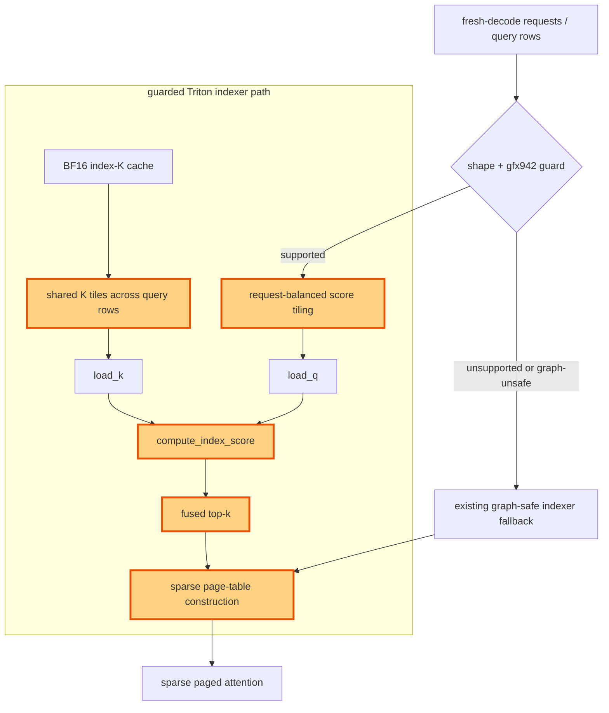

## 1. Module diagram

## 2. Motivation

Balance fresh-decode index scoring and avoid repeated K-cache traffic by sharing K tiles and fusing top-k selection with sparse page-table construction without sacrificing graph-safe fallback behavior.

## 3. Before vs. after

| Behavior | Before | After |
|---|---|---|
| Score scheduling | Fresh-decode index rows use the existing score tiling and request-work distribution. | Supported rows use request-balanced score tiles. |
| K-cache reads | Query rows can reload the same K tiles independently. | Compatible query rows share K tiles in the Triton score path. |
| Selection and page metadata | Top-k selection and sparse page-table construction are separate stages or launches. | The guarded Triton path performs top-k selection and page-table construction together. |
| Dispatch | The existing indexer dispatch does not select this shape-specific fused path. | Shape, dtype, layout, and architecture checks select the fused path only when its contract holds. |
| Unsupported and graph-sensitive cases | Existing fallback behavior handles unsupported shapes and graph-sensitive state. | The same graph-safe fallback remains selected when the new path is unsupported or unsafe. |
| Results | The indexer emits selected blocks and metadata through the existing pipeline. | The fused path emits equivalent selected blocks and sparse page-table metadata to sparse attention. |

## 4. MiniMax-M3 migration steps

1. On the current M3 snapshot—8× MI325X/gfx942, TP8/PP1/DP1, EP off, vLLM `0.26.0+rocm723`, AITER dense/sparse attention, Triton indexer, FP8 main KV, shared-expert fusion, INT4 QuickReduce, and DSpark draft `TRITON_ATTN`—locate the fresh-decode implementation in `models/minimax_m3/common/indexer.py:404–523` and its `compute_index_score`/top-k dispatch, then trace the causal selection in `models/minimax_m3/common/ops/index_topk.py:88–245`.
2. Port the smallest request-balanced tiling, shared-K, and fused top-k/page-table change from PR [#54682](https://github.com/vllm-project/vllm/pull/54682) into those indexer symbols, preserving the existing BF16 index-cache layout, score/top-k dtypes, sparse-page-table contract, AITER sparse-attention consumer, and TP8 ownership.
3. Guard the new dispatch by gfx942 support, query/index-head counts, head dimension, page/block size, strides, dtype/layout, sequence length, and graph-safe metadata/workspace state; retain the existing `indexer.py`/`index_topk.py` fallback for every unsupported or graph-unsafe case rather than copying gfx950 constants.
4. Compare old and new selected indices, page tables, sparse-attention outputs, cache writes, and eager plus graph-capture/replay results on M3 decode and MTP-shaped batches; benchmark only after those correctness checks match.
