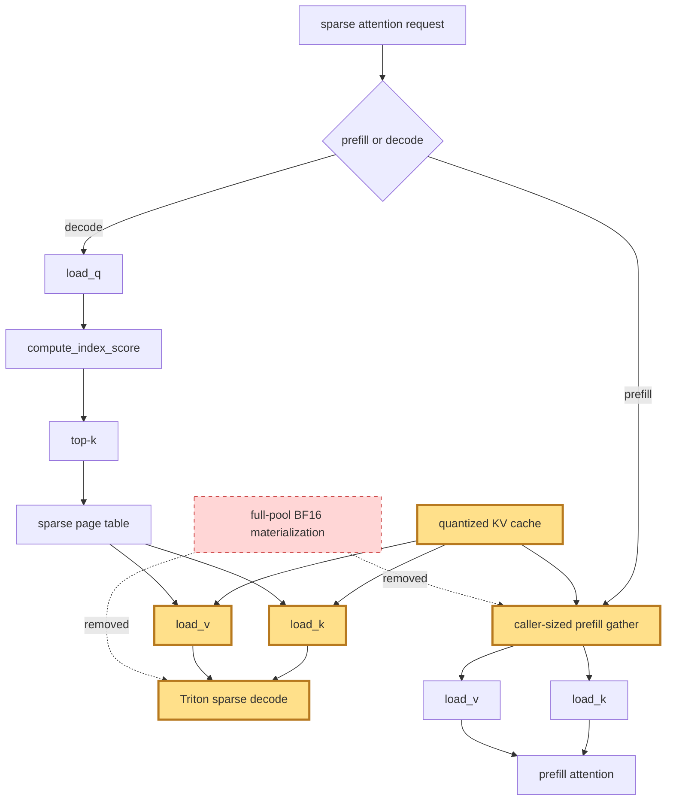

## 1. Module diagram

## 2. Motivation

Reading quantized KV data directly during sparse decode and gathering only the caller-sized prefill region removes unnecessary full-pool BF16 materialization.

## 3. Before vs. after

| Area | Before | After |
|---|---|---|
| Decode cache input | The sparse decode path materializes the complete quantized-cache pool as BF16 before attention. | The Triton decode path reads the quantized cache directly for the selected sparse pages. |
| Decode conversion helpers | Decode depends on the separate `rocm_forward_decode_fallback` and `rocm_dequantize_blocked_k_cache` materialization path. | Those full-pool conversion steps are absent from the direct quantized-cache path. |
| Prefill gather extent | Prefill gather uses a full-pool or broadly provisioned temporary region. | Prefill gather uses a chunk sized by the caller’s requested range. |
| KV data movement | Cache data outside the selected pages or requested prefill range is materialized and moved. | Decode loads selected quantized K/V pages, while prefill transfers only the caller-sized region. |
| Temporary storage | A full-pool BF16 temporary buffer is required. | The full-pool BF16 temporary buffer is not allocated. |

## 4. MiniMax-M3 migration steps

**Migration: unverified.**

- The action source identifies PR [#41812](https://github.com/vllm-project/vllm/pull/41812) and the target symbols `rocm_forward_decode_fallback` and `rocm_dequantize_blocked_k_cache`, but this workspace contains no vLLM source file defining or calling those symbols, so their exact target file cannot be established here.
- The M3 launch evidence in `20260826-replicate-enhui-pipeline-on-mi325x-01/vllm_recipe_bench_mi325x.slurm:51-55` identifies `presets/minimax-m3/mi325x/e2e/best.yaml`, `runners/vllm-serve`, and `/data/checkpoints/EmbeddedLLM/MiniMax-M3-FP8-dynamic`; it does not expose the sparse-decode or prefill-gather symbol reached inside the vLLM `0.26.0+rocm723` image.
- Therefore source code does not establish either a reachable M3 call path or a blocker for the 8× MI325X/gfx942, TP8/PP1/DP1, EP-off, AITER dense/sparse-attention, Triton-indexer, FP8-main-KV snapshot; inspect the image’s sparse-MLA implementation before choosing a guarded port and compare quantized-cache outputs, graph replay, and prefill/decode boundaries against the current path.
