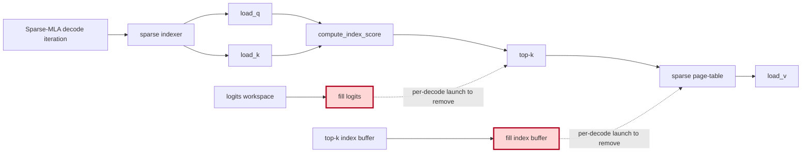

## 1. Module diagram

## 2. Motivation

Removing redundant sparse-MLA fill and fill-functor launches shortens the decode hot loop while retaining initialization wherever the selected kernel does not fully overwrite its outputs.

## 3. Before vs. after

| Behavior | Before | After |
|---|---|---|
| Decode-loop initialization | The sparse-MLA path launches fill operations for logits and/or index buffers before selection. | The supported path omits those per-decode fill launches. |
| Buffer production | Selection consumes buffers after a separate initialization step. | The producing sparse-index/top-k kernels write the entries consumed by the next operation. |
| Backend dispatch | The same initialization sequence is used without proving that every backend overwrites all consumed entries. | Fill elision is restricted to a kernel/backend path whose write coverage is established. |
| Fallback and graph safety | Fallback paths retain their existing initialization and launch ordering. | Unsupported, partial-write, or graph-unsafe cases continue using the existing fallback behavior. |

## 4. MiniMax-M3 migration steps

**Migration: unverified.**

The action is tracked by PR [#44527](https://github.com/vllm-project/vllm/pull/44527), but that PR's checked-out implementation and exact fill/fill-functor symbols are not present in this workspace, so the target source call path cannot be established.  The M3 source inventory identifies `models/minimax_m3/common/indexer.py:404–523` as the Triton index scoring/top-k and BF16 index-cache path, but does not establish whether it launches the fills targeted by #44527; the inspected snapshot is 8× MI325X/gfx942, vLLM `0.26.0+rocm723`, TP8/PP1/DP1, AITER dense/sparse attention, Triton indexer, FP8 main KV, and DSpark draft `TRITON_ATTN`. Do not remove a fill until the exact image source confirms complete writes for every consumed logits/index entry and preserves the existing fallback and graph-replay behavior.
