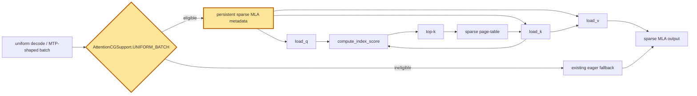

## 1. Module diagram

## 2. Motivation

Uniform ROCm sparse-MLA and MTP-shaped batches need stable metadata and graph-safe dispatch so eligible decode steps can use captured replay while unsupported shapes retain the existing path.

## 3. Before vs. after

| Area | Before | After |
|---|---|---|
| Uniform-batch dispatch | Uniform sparse-MLA batches use the ordinary dispatch path. | Batches satisfying `AttentionCGSupport.UNIFORM_BATCH` are admitted to CUDA/HIP graph capture and replay. |
| MTP-shaped batches | MTP-shaped metadata is not necessarily recognized as a uniform graph shape. | Supported MTP-shaped batches use the same graph eligibility and replay path. |
| Metadata lifetime | Sparse MLA metadata may be rebuilt or rebound for each step. | Captured execution uses persistent metadata and stable tensor addresses. |
| Unsupported shapes | Non-uniform or graph-unsafe inputs still execute through the regular implementation. | The existing guarded eager fallback remains selected for unsupported inputs. |
| Attention work | `load_q`, `load_k`, `load_v`, index scoring, top-k, and sparse-page-table construction follow the existing launch sequence. | The same operations execute from a captured graph for eligible batches. |

## 4. MiniMax-M3 migration steps

**Current M3 snapshot:** 8× MI325X/gfx942, TP8/PP1/DP1, EP off, vLLM `0.26.0+rocm723`, AITER dense/sparse attention, Triton indexer, FP8 main KV, shared-expert fusion, INT4 QuickReduce, and DSpark with draft `TRITON_ATTN`.

1. In the deployed vLLM tree, trace `MiniMaxM3SparseAttention.__init__`/`forward` in `vllm/models/minimax_m3/amd/model.py` (or the versioned M3 ROCm model file) through `select_main_impl_cls` and `select_indexer_impl_cls`; verify that the selected sparse backend reaches the `AttentionCGSupport.UNIFORM_BATCH` declarations in `common/sparse_attention.py` and `common/indexer.py` (the corresponding construction and symbols are documented in `20260914-best-parallelism/repos/aiconfigurator/collector/vllm/collect_msa_module.py`).
2. Port only PR [#45149](https://github.com/vllm-project/vllm/pull/45149)'s uniform-batch admission and MTP metadata handling at that call path, preserving M3's AITER sparse-attention backend, Triton indexer, FP8 KV layout, and TP8/PP1/DP1 contracts; do not replace model-specific attention dispatch.
3. Guard graph admission by uniform token shape, MTP metadata, gfx942 support, dtype/layout, stable cache and metadata addresses, and capture-bucket availability, retaining the existing eager sparse-MLA fallback for every failed guard.
4. Compare eager and captured replay on M3 decode and DSpark verification, checking attention outputs, selected sparse pages, KV-cache writes, accepted draft tokens, and replay across every tested batch shape before benchmarking.
