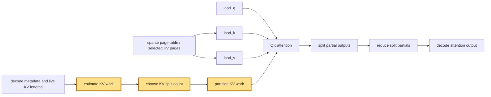

## 1. Module diagram

## 2. Motivation

Selecting decode KV splits from live work avoids applying one fixed partition cap to batches with different context lengths and sparse KV workloads.

## 3. Before vs. after

| Area | Before | After |
|---|---|---|
| Split-count selection | Decode KV work uses a fixed cap or fixed split policy. | The selector derives a bounded split count from estimated live KV work and a work-per-split target. |
| Context handling | Short and long decode contexts follow the same partition rule. | Context length and selected sparse KV work influence partitioning. |
| Work partitioning | KV ranges are divided according to the fixed count. | KV ranges are divided according to the selected per-shape count. |
| Partial reduction | The reducer consumes partials produced by the fixed partition policy. | The reducer consumes partials produced by the selected split policy. |
| Unsupported shapes | Existing backend behavior handles shapes outside the fixed policy's assumptions. | The existing supported-policy fallback remains selected when the heuristic's constraints are not met. |

## 4. MiniMax-M3 migration steps

**Migration: unverified.**

- The action is attributed to [PR #46832](https://github.com/vllm-project/vllm/pull/46832), but this workspace contains no checked-out vLLM implementation or exact work-per-split selector symbol for that PR.
- The M3 source inventory identifies `models/minimax_m3/common/indexer.py:404–523` for Triton index scoring/top-k and `models/minimax_m3/common/ops/index_topk.py:88–245` for causal block selection in `20260914-best-parallelism/MINIMAX-M3-PARALLEL.md`; it does not identify a KV-split selector or the selected-KV attention reduction symbol.
- Consequently, source evidence does not establish that the PR’s selector is reachable from the current snapshot—8× MI325X/gfx942, TP8/PP1/DP1, EP off, vLLM `0.26.0+rocm723`, AITER dense/sparse attention, Triton indexer, FP8 main KV, shared-expert fusion, INT4 QuickReduce, and DSpark draft `TRITON_ATTN`—or establish a blocker; inspect the deployed image before choosing a guarded port.
