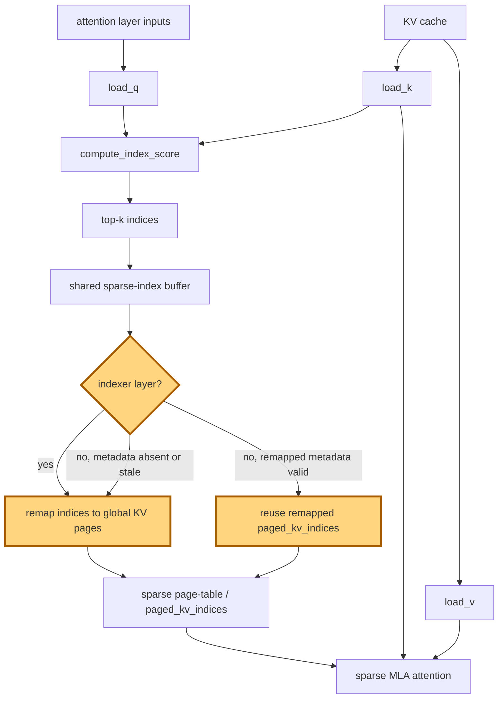

## 1. Module diagram

## 2. Motivation

Non-indexer layers should reuse valid remapped sparse indices instead of repeating the same index-to-page remap.

## 3. Before vs. after

| Behavior | Before | After |
|---|---|---|
| Indexer layer remapping | Remaps newly produced top-k indices before constructing the sparse page table. | Remaps newly produced top-k indices as before. |
| Non-indexer layer with valid shared metadata | Repeats the sparse-index remap for the shared top-k result. | Reuses the already remapped `paged_kv_indices`. |
| Missing or stale metadata | Performs the normal remap from the layer's index buffer. | Performs the normal remap because the reuse guard does not pass. |
| Sparse attention inputs | Receives page indices after each layer's remap path. | Receives equivalent page indices while eligible non-indexer layers skip the duplicate remap. |
| Unsupported or graph-unsafe cases | Follow the existing remap implementation. | Retain the existing remap implementation. |

## 4. MiniMax-M3 migration steps

**Migration: unverified.**

- The action cites PR #51309, but its implementation and exact target file/symbol are not present in this workspace; therefore the source does not establish the metadata-validity predicate or remap call site.
- The available M3 source inventory identifies `models/minimax_m3/common/indexer.py:404–523` for index scoring/top-k and `models/minimax_m3/common/ops/index_topk.py:88–245` for causal selection, but it does not identify a matching non-indexer remap symbol or shared `paged_kv_indices` metadata contract.
- The target snapshot is 8× MI325X/gfx942, TP8/PP1/DP1, EP off, vLLM `0.26.0+rocm723`, AITER dense/sparse attention, Triton indexer, FP8 main KV, shared-expert fusion, INT4 QuickReduce, and DSpark draft `TRITON_ATTN`; inspect that deployed tree for the missing target and M3 symbols before applying a guarded port.
