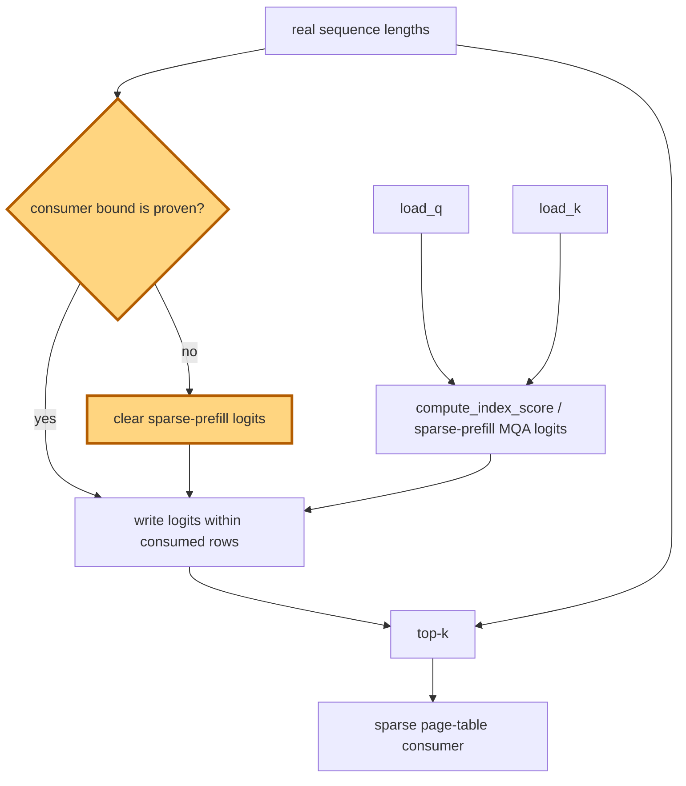

## 1. Module diagram

## 2. Motivation

Avoid initializing sparse-prefill MQA-logit entries that every consumer is already guaranteed not to read.

## 3. Before vs. after

| Behavior | Before | After |
|---|---|---|
| Logit-buffer initialization | Clears the sparse-prefill MQA-logit buffer before producing logits. | Skips the clear when real sequence lengths bound all subsequent reads. |
| Consumer contract | Consumers may rely on initialization outside the produced sequence range. | Consumers use only logits covered by the explicit real-length bound. |
| Unproven bounds | Uses the clearing path. | Retains the clearing path whenever a read bound is unavailable or uncertain. |
| Data movement | Performs writes across the cleared region. | Eliminates those writes only in the guarded bounded-consumer path. |

## 4. MiniMax-M3 migration steps

**Migration: unverified.** The local workspace contains the action description and PR reference (`#51314`), but no vLLM source tree exposing the target sparse-prefill MQA-logit producer, clear operation, or consumer symbol; it therefore cannot establish the exact MiniMax-M3 call path or a source-backed blocker. The relevant snapshot is 8× MI325X/gfx942, vLLM `0.26.0+rocm723`, TP8/PP1/DP1, EP off, AITER dense/sparse attention, Triton indexer, FP8 main KV, shared-expert fusion, INT4 QuickReduce, and DSpark draft `TRITON_ATTN`; inspect that deployed image’s source before changing the clear contract, and retain the clear until every prefill/MTP consumer is proven bounded and graph replay is checked.
