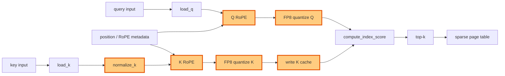

## 1. Module diagram

## 2. Motivation

Fusing K normalization, Q/K RoPE, FP8 quantization, and K-cache writing can remove intermediate prologue handoffs before DSA index scoring.

## 3. Before vs. after

| Behavior | Before | After |
|---|---|---|
| Prologue execution | K normalization, Q/K RoPE, FP8 conversion, and cache writing are separate stages or launches. | The supported DSA indexer path executes those stages through one fused prologue. |
| Intermediate data movement | Stage outputs cross intermediate tensor or global-memory boundaries. | Dependent values remain within the fused prologue where the implementation permits. |
| Query handoff | The index scorer receives Q after the independent RoPE and quantization stages complete. | The fused prologue passes the same FP8 query contract to `compute_index_score`. |
| K-cache update | Quantized K is handed to a separate cache-write operation. | The fused prologue writes the quantized K to the existing cache slot and layout. |
| Downstream selection | Top-k and sparse-page-table construction consume the existing indexer outputs. | Top-k and sparse-page-table consumers retain the same output semantics. |

## 4. MiniMax-M3 migration steps

**Migration: unverified.**

The action targets DSA indexer-prologue work in PR [#51315](https://github.com/vllm-project/vllm/pull/51315), but this workspace has no checked-out vLLM source or PR implementation exposing the target symbols for K normalization, Q/K RoPE, FP8 quantization, and K-cache writing.  The available MiniMax-M3 source inventory identifies `models/minimax_m3/common/indexer.py:404–523` for Triton index scoring/top-k and BF16 index-cache selection and `models/minimax_m3/common/ops/index_topk.py:88–245` for causal selection, but it does not establish a matching prologue call path or its exact symbols.

The snapshot to inspect is 8× MI325X/gfx942, TP8/PP1/DP1, EP off, vLLM `0.26.0+rocm723`, AITER dense/sparse attention, Triton indexer, FP8 main KV, shared-expert fusion, INT4 QuickReduce, and DSpark with draft `TRITON_ATTN`.  Until the exact image source is available, the reachable M3 prologue and any dtype/layout/architecture blocker cannot be established; do not fuse the stages or remove the existing fallback based only on the issue description.
