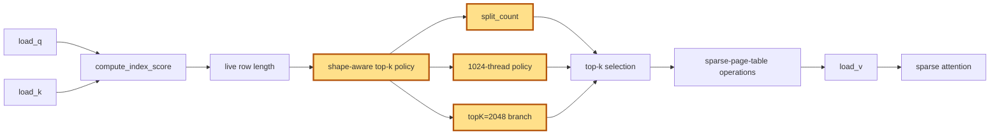

## 1. Module diagram

## 2. Motivation

The sparse-indexer top-k launch policy should derive split count and thread selection from live row length while handling `topK=2048` explicitly instead of copying gfx950-specific defaults.

## 3. Before vs. after

| Area | Before | After |
|---|---|---|
| Split selection | Top-k work uses a fixed or insufficiently shape-aware split policy. | Split count is selected from the live row length and supported top-k shape. |
| Thread selection | The 1024-thread choice is not keyed to the current row length. | The 1024-thread policy is selected through the shape-aware policy. |
| `topK=2048` dispatch | The 2048 case follows a generic or missing branch. | `topK=2048` has an explicit calibrated policy branch. |
| Sparse-indexer output | Top-k still produces the sparse selection consumed by the page-table path. | The selected policy feeds the same top-k and sparse-page-table output contracts. |
| Unsupported shapes | A newly tuned policy could be applied outside its supported shape range. | The existing top-k fallback remains selected when the shape or architecture is unsupported. |

## 4. MiniMax-M3 migration steps

Migration: unverified. The action is documented as the candidate gfx950/GLM-5.3 change from issue [#55327](https://github.com/vllm-project/vllm/issues/55327), but this workspace contains no target implementation exposing its split-count or 1024-thread policy symbols. The MiniMax-M3 source inventory identifies `models/minimax_m3/common/indexer.py:404–523` for Triton index scoring/top-k and `models/minimax_m3/common/ops/index_topk.py:88–245` for causal block selection, but does not establish that either path has the target policy or a reachable gfx942 implementation. The relevant snapshot is 8× MI325X/gfx942, TP8/PP1/DP1, EP off, vLLM `0.26.0+rocm723`, AITER dense/sparse attention, Triton indexer, FP8 main KV, shared-expert fusion, INT4 QuickReduce, and DSpark draft `TRITON_ATTN`; locate the actual policy symbols there before porting any gfx950 constants.
