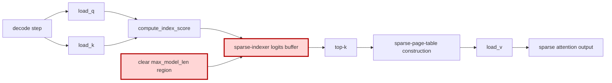

## 1. Module diagram

## 2. Motivation

Avoid clearing logits outside the real sequence-length bounds when the sparse-indexer consumers do not read those entries.

## 3. Before vs. after

| Behavior | Before | After |
|---|---|---|
| Logits initialization | The decode path clears the full `max_model_len` sparse-indexer logits region. | The decode path propagates a `clean_logits=False`-equivalent contract and does not clear the unused region. |
| Valid-row consumption | Top-k and sparse-page-table construction may rely on cleared out-of-range values. | Top-k and sparse-page-table construction consume only rows bounded by actual sequence lengths. |
| Buffer contents | Every decode step writes zeros across the full configured context bound before score production. | Entries outside the current valid bounds remain untouched and are not treated as readable results. |
| Unsupported consumers | A consumer that reads beyond the valid sequence range can observe the cleared region. | The no-clear path is used only when every consumer has an explicit valid-length bound; otherwise the existing clear path remains selected. |

## 4. MiniMax-M3 migration steps

**Migration: unverified.**

The action target is the candidate `fp8_fp4_paged_mqa_logits(..., clean_logits=False)` path tracked by [#55373](https://github.com/vllm-project/vllm/issues/55373), but this workspace contains no vLLM checkout exposing its decode caller or the candidate implementation.  The only local occurrence is the benchmark helper call in `20260914-best-parallelism/repos/aiconfigurator/collector/vllm/collect_dsv4_attn.py` (inside `_bench_mla_sparse_op`), which is not a MiniMax serving dispatch.  The local MiniMax model description at `20260914-best-parallelism/repos/aiconfigurator/aic-core/src/aiconfigurator_core/model_configs/MiniMaxAI--MiniMax-M3_config.json` exposes sparse-index configuration but no logits-buffer producer or consumer symbols.  Consequently, source code here does not establish whether the current 8× MI325X/gfx942, vLLM `0.26.0+rocm723`, TP8/PP1/DP1, EP-off, AITER dense/sparse-attention, Triton-indexer, FP8-main-KV M3 snapshot clears `max_model_len` or whether all consumers are length-bounded; locate those vLLM symbols before porting and retain the existing clear fallback until both facts are proven.
