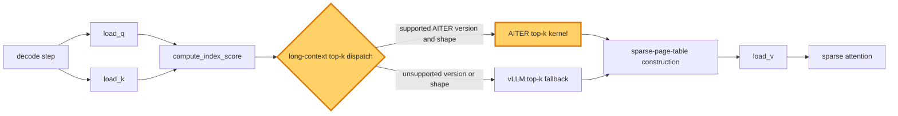

## 1. Module diagram

## 2. Motivation

The long-context sparse-indexer path should select AITER top-k when the installed kernel supports the exact M3 shape instead of using the historical `>64K` vLLM fallback unconditionally.

## 3. Before vs. after

| Behavior | Before | After |
|---|---|---|
| Long-context dispatch | Contexts above the `64K` threshold use the vLLM top-k implementation. | The dispatcher checks AITER capability and routes supported long-context shapes to AITER top-k. |
| Capability guard | The branch is controlled by the legacy length threshold and fallback condition. | Version, architecture, dtype, layout, top-k, and score-shape support determine AITER eligibility. |
| Unsupported cases | The vLLM kernel handles the long-context case. | The vLLM kernel remains the fallback for unsupported versions, shapes, and layouts. |
| Downstream metadata | Selected indices feed the existing sparse page-table construction. | Selected indices continue to feed the same sparse page-table contract regardless of kernel choice. |

## 4. MiniMax-M3 migration steps

**Migration: unverified.**

The workspace contains no vLLM checkout exposing the target issue's AITER top-k implementation or its `>64K` dispatch symbol, so the source does not establish the exact patch point for [#55615](https://github.com/vllm-project/vllm/issues/55615).  The MiniMax-M3 source inventory identifies `models/minimax_m3/common/indexer.py:404–523` for Triton index scoring/top-k and `models/minimax_m3/common/ops/index_topk.py:88–245` for causal top-k selection in `20260914-best-parallelism/MINIMAX-M3-PARALLEL.md`, but neither local source file is checked out here and neither proves an AITER top-k call or a `>64K` guard.  Before any port, inspect those symbols in the exact M3 image—8× MI325X/gfx942, TP8/PP1/DP1, EP off, vLLM `0.26.0+rocm723`, AITER dense/sparse attention, Triton indexer, FP8 main KV, shared-expert fusion, INT4 QuickReduce, and DSpark draft `TRITON_ATTN`—then retain the existing vLLM path unless the installed AITER version supports the exact score shape, dtype, layout, index-top-k, and graph-capture/replay contract and produces identical indices and sparse page tables.
