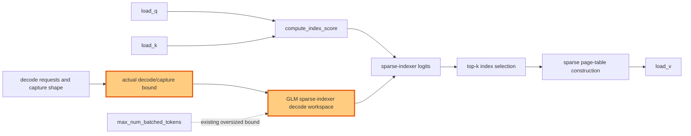

## 1. Module diagram

## 2. Motivation

The sparse-indexer decode workspace should be bounded by the actual decode and graph-capture shapes instead of reserving rows from `max_num_batched_tokens`.

## 3. Before vs. after

| Area | Before | After |
|---|---|---|
| Workspace bound | Decode workspace sizing uses `max_num_batched_tokens` as its reservation bound. | Decode workspace sizing uses the actual decode bound and the capture bound required by replay. |
| Allocation scope | The allocation can reserve capacity unrelated to the number of decode rows in the active sparse-indexer path. | The allocation is sized for the rows that the decode and capture paths can actually submit. |
| Indexer pipeline | `compute_index_score` writes into the broadly reserved workspace before top-k and sparse-page-table processing. | `compute_index_score` writes into the bounded workspace, while top-k and sparse-page-table operations retain their existing data flow. |
| Unsupported shapes and replay | Existing fallback behavior handles shapes outside the current workspace assumptions. | The existing fallback remains selected when the bounded formula cannot cover a requested decode or capture shape. |

## 4. MiniMax-M3 migration steps

**Migration: unverified.** The checkout contains the action description and issue/PR references, but no vLLM source tree exposing the GLM sparse-indexer workspace allocator or its MiniMax-M3 counterpart (such as the relevant workspace-construction and `compute_index_score` symbols), so source code does not establish either a reachable M3 call path or a blocker. The documented M3 snapshot is 8× MI325X/gfx942, TP8/PP1/DP1, EP off, vLLM `0.26.0+rocm723`, AITER dense/sparse attention, Triton indexer, FP8 main KV, shared-expert fusion, INT4 QuickReduce, and DSpark with draft `TRITON_ATTN`; inspect that image’s GLM/MiniMax indexer source before choosing a bounded workspace formula.
