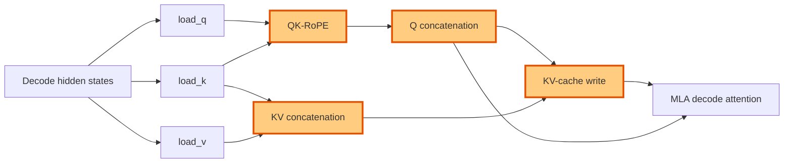

## 1. Module diagram

## 2. Motivation

Fuse decode QK-RoPE, Q concatenation, KV concatenation, and KV-cache writing so the MLA preparation path does not materialize avoidable intermediate tensors between launches.

## 3. Before vs. after

| Behavior | Before | After |
|---|---|---|
| Q/K positional preparation | QK-RoPE runs as a separate preparation operation. | QK-RoPE is part of the fused AITER preparation path. |
| Query assembly | Q components are concatenated in a separate operation before attention. | Q components are concatenated within the fused preparation operation. |
| KV assembly | K and V components are assembled independently of the cache update. | K and V components are assembled within the fused preparation operation. |
| Cache update | The assembled KV data reaches a separate cache-write operation. | The fused path writes KV directly in the required cache layout. |
| Intermediate tensors and launches | Preparation stages can pass materialized intermediate Q/KV tensors across launches. | Compatible intermediate materialization and preparation launches are combined. |

## 4. MiniMax-M3 migration steps

**Migration: unverified.** The target evidence in `ACTIONS.md:32` identifies issue #57230 and PR #47757 but this workspace has no checked-out vLLM/AITER implementation exposing the target file and symbols for the fused QK-RoPE, concatenation, and KV-cache-write path. The available MiniMax-M3 launch records in `20260826-replicate-enhui-pipeline-on-mi325x-01/slurm/vllm_recipe_bench_mi325x.slurm:52-55` identify the preset and model, while `20260826-replicate-enhui-pipeline-on-mi325x-01/slurm/geak-profile-topk-8k1k.sbatch:86-87` records AITER/unified-attention settings; neither exposes the matching M3 decode symbols or proves that PR #47757's MLA layout and cache-write contract are reachable. The current documented snapshot is 8× MI325X/gfx942, TP8/PP1/DP1, EP off, vLLM `0.26.0+rocm723`, AITER dense/sparse attention, Triton indexer, FP8 main KV, shared-expert fusion, INT4 QuickReduce, and DSpark draft `TRITON_ATTN`; source evidence is insufficient to establish either a migration path or a blocker.
