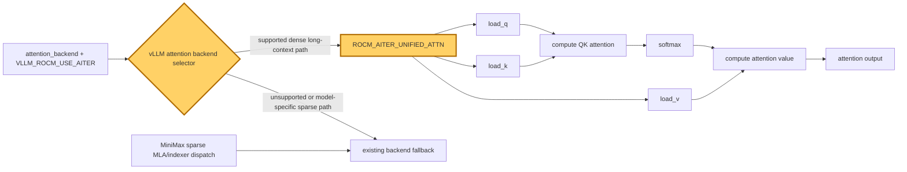

## 1. Module diagram

## 2. Motivation

Explicitly selecting AITER unified attention prevents a supported long-context AMD request from silently taking the generic `ROCM_ATTN` backend while preserving MiniMax-specific sparse dispatch.

## 3. Before vs. after

| Behavior | Before | After |
|---|---|---|
| Backend choice | A generic backend selection can resolve a supported dense request to `ROCM_ATTN`. | The configured selector chooses `ROCM_AITER_UNIFIED_ATTN` for the supported dense path. |
| AITER enablement | Backend choice and AITER availability are not necessarily coupled by an explicit configuration check. | The unified choice is used only when AITER is enabled and its backend is available. |
| Sparse MiniMax layers | A global backend choice may be applied without distinguishing sparse MLA/indexer layers. | Sparse MLA/indexer dispatch remains model-specific; unified attention is limited to its compatible path. |
| Unsupported shapes or layouts | The generic or existing fallback handles unsupported combinations. | Device, dtype, layout, shape, and backend-capability checks retain the existing fallback for unsupported combinations. |

## 4. MiniMax-M3 migration steps

**Migration: unverified.** The workspace records the M3 setting and launch, but does not contain the exact-image vLLM source root that would expose the selector symbol and prove whether any request still reaches `ROCM_ATTN`; the documented M3 source inventory identifies `models/minimax_m3/amd/model.py:449–714` for attention construction, while the backend implementation/selection source is absent locally.

1. Inspect `20260914-parallelism-in-mm3/inspection/vllm/models/minimax_m3/amd/model.py` (the exact-image source cited by `20260914-best-parallelism/MINIMAX-M3-PARALLEL.md`) and the vLLM backend registry/selector symbol, then trace the dense and sparse `forward` calls for the M3 model.
2. Reproduce the current snapshot—8× MI325X/gfx942, TP8/PP1/DP1, EP off, vLLM `0.26.0+rocm723`, FP8 main KV, AITER dense/sparse attention, Triton indexer, shared-expert fusion, INT4 QuickReduce, and DSpark draft `TRITON_ATTN`—with `attention_backend=ROCM_AITER_UNIFIED_ATTN` and `VLLM_ROCM_USE_AITER=1`, as recorded in `20260828-model-level-optimization/docs/mi325x-fp8-recommendation.md:38` and `20260826-replicate-enhui-pipeline-on-mi325x-01/slurm/geak-profile-topk-8k1k.sbatch:86`.
3. Add or retain the smallest selector guard for MI325X/gfx942, AITER availability, M3 dense-attention layout/dtype, and supported long-context shapes; leave sparse MLA/indexer and unsupported cases on their existing backend fallback rather than forcing the global setting.
4. Compare effective backend dispatch and outputs for dense decode, sparse decode, prefill, and DSpark graph capture/replay before any benchmark; only then run the matched FP8-KV long-context A/B.
