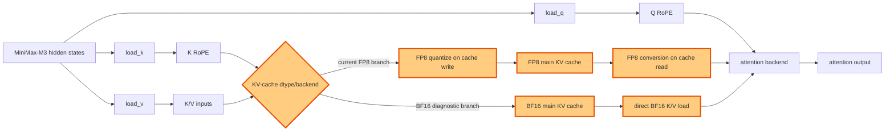

## 1. Module diagram

## 2. Motivation

A BF16 main KV-cache branch isolates whether FP8 cache conversion, rather than attention arithmetic, is the limiting cost on a backend without an efficient native FP8 path.

## 3. Before vs. after

| Behavior | Before | After |
|---|---|---|
| Main KV-cache dtype | The serving launch requests FP8 main KV storage. | The diagnostic branch requests BF16 main KV storage. |
| Cache write | K/V values are converted to FP8 before entering the main cache and use FP8 scale metadata. | K/V values are written as BF16 without the FP8 cache conversion and scale contract. |
| Cache read | Attention reads the FP8 cache through the backend's FP8 conversion/dequantization path. | Attention reads BF16 K/V directly through its BF16-compatible path. |
| Backend selection | The configured attention path is allowed to consume the FP8 main cache. | The BF16-compatible path is selected only when the resolved backend accepts the BF16 cache layout; the existing FP8 branch remains available otherwise. |
| Index cache | The model-specific indexer retains its separate index-cache contract. | Only the main KV-cache dtype changes; indexer layout, sparse selection, and index-cache behavior remain unchanged. |

## 4. MiniMax-M3 migration steps

**Migration: unverified.** The workspace proves that the current M3 launch reaches an FP8 cache configuration, but it does not include the exact-image generic vLLM cache read/write implementation needed to establish whether gfx942 has the native FP8 path required by this action.

1. In the exact vLLM image, trace the `kv_cache_dtype` resolution and main-cache write/read symbols from `models/minimax_m3/amd/model.py:449–714`; use `20260826-replicate-enhui-pipeline-on-mi325x-01/slurm/geak-profile-topk-8k1k.sbatch:92` as the current M3 entry point (`--kv-cache-dtype fp8`), while keeping the model's separate BF16 index-cache path distinct.
2. Re-run the same snapshot—8× MI325X/gfx942, TP8/PP1/DP1, EP off, vLLM `0.26.0+rocm723`, AITER dense/sparse attention, Triton indexer, shared-expert fusion, INT4 QuickReduce, and DSpark draft `TRITON_ATTN`—with only `--kv-cache-dtype bf16` changed; preserve the existing `ROCM_AITER_UNIFIED_ATTN` setting and cache block size.
3. Enable the BF16 branch only if the resolved attention/cache symbols accept the BF16 layout on gfx942 and the FP8 branch remains the guarded fallback for unsupported backends, dtypes, layouts, or graph-capture configurations.
4. Compare FP8 and BF16 outputs on identical prefill, long-context decode, and DSpark verification requests, then verify cache integrity and graph capture/replay before benchmarking the two configurations.
