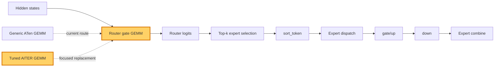

## 1. Module diagram

## 2. Motivation

The MoE router gate should use the tuned AITER GEMM only when its exact MiniMax-M3 shape and dtype contract is supported, while retaining the generic route otherwise.

## 3. Before vs. after

| Behavior | Before | After |
|---|---|---|
| Router projection | The router gate uses the generic ATen GEMM path. | The router gate dispatches to the tuned AITER GEMM for eligible inputs. |
| Kernel selection | Selection does not expose this action’s AITER shape and dtype eligibility guard. | Selection checks the supported AITER route before dispatching. |
| Routing flow | Router logits feed top-k selection, `sort_token`, expert dispatch, gate/up, down, and combine. | The same routing and expert flow consumes logits produced by the selected GEMM. |
| Unsupported inputs | The generic GEMM path handles the router projection. | The generic ATen GEMM remains the fallback for unsupported shapes, dtypes, layouts, or backends. |

## 4. MiniMax-M3 migration steps

**Migration: unverified.** The target evidence identifies PR [#50535](https://github.com/vllm-project/vllm/pull/50535), but this workspace contains no checked-out target implementation exposing its AITER router-GEMM file or dispatch symbol. The available MiniMax-M3 source inventory identifies `models/minimax_m3/amd/model.py:112–126,255–438` for the FP32 replicated router and fused expert construction, plus `model_executor/layers/fused_moe/runner/moe_runner.py:410–466,731–779` for routed/shared combination; it does not expose the router projection call or prove that PR #50535’s AITER GEMM is reachable. The current snapshot is 8× MI325X/gfx942, TP8/PP1/DP1, EP off, vLLM `0.26.0+rocm723`, AITER dense/sparse attention, Triton indexer, FP8 main KV, shared-expert fusion, INT4 QuickReduce, and DSpark draft `TRITON_ATTN`; inspect the deployed image for both symbols before choosing a guarded port.
