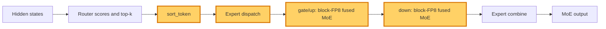

## 1. Module diagram

## 2. Motivation

Specializing block-FP8 fused-MoE scheduling for low-batch decode keeps token sorting, expert dispatch, and gate/up/down execution aligned with decode-sized shapes.

## 3. Before vs. after

| Stage | Before | After |
|---|---|---|
| `sort_token` | Uses the general fused-MoE token sorting schedule. | Selects a low-batch decode schedule when the token and expert-count guards match. |
| Expert dispatch | Dispatches tokens using the general shape policy. | Passes decode-sized per-expert shapes and metadata to the guarded fused-MoE path. |
| `gate/up` | Uses the existing block-FP8 fused-MoE tiling and launch policy for all supported shapes. | Uses decode-specific block-FP8 tiling and launch parameters for eligible shapes. |
| `down` | Uses the general fused-MoE scheduling policy after expert computation. | Uses the matching decode-specific schedule while preserving the existing output layout. |
| Unsupported cases | Existing dispatch handles shapes or dtypes outside the tuned kernel contract. | The existing dispatch and kernel fallback remain selected when dtype, layout, architecture, or shape guards fail. |

## 4. MiniMax-M3 migration steps

**Migration: unverified.**

- The action is attributed to PR [#46642](https://github.com/vllm-project/vllm/pull/46642), but that PR's source diff and target block-FP8 kernel symbols are not present in this workspace, so the exact target call path and guards cannot be established without inventing them.
- The available M3 source inventory identifies `models/minimax_m3/amd/model.py:112–438` as the model's fused-expert construction path, while the M3 snapshot is 8× MI325X/gfx942, TP8/PP1/DP1, EP off, vLLM `0.26.0+rocm723`, dynamic FP8 routed experts, and AITER/shared-expert fusion; it does not establish that routed experts reach the PR's block-FP8 kernel family.
- Until the exact PR symbols and the deployed M3 dispatch are available, do not alter the backend, dtype, layout, or parallelism; compare the existing `sort_token` → dispatch → `gate/up` → `down` path only after those source paths and graph-safe fallback guards are identified.
