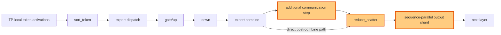

## 1. Module diagram

## 2. Motivation

Remove the redundant post-combine communication step while retaining sequence-parallel sharding when the MoE output layout supports it.

## 3. Before vs. after

| Area | Before | After |
|---|---|---|
| Post-combine communication | Expert outputs traverse an additional communication step before reduce-scatter. | Expert outputs enter the reduce-scatter path directly. |
| Output layout | The intermediate result may be replicated or reshaped before downstream consumption. | Reduce-scatter produces the downstream TP-local or sequence-sharded layout directly. |
| Sequence parallelism | Applicable sequence-parallel output sharding is not selected on the affected path. | Sequence-parallel sharding is selected when token and group layouts satisfy its contract. |
| Expert computation | `sort_token`, dispatch, `gate/up`, `down`, and combine perform the routed-expert computation. | Routed-expert computation remains unchanged; only post-combine communication and output layout handling change. |

## 4. MiniMax-M3 migration steps

**Migration: unverified.** The action is attributed to vLLM PRs [#46635](https://github.com/vllm-project/vllm/pull/46635), [#47070](https://github.com/vllm-project/vllm/pull/47070), and [#48763](https://github.com/vllm-project/vllm/pull/48763), but this workspace contains no vLLM source checkout exposing the target reduce-scatter symbol or the matching MiniMax-M3 MoE call path. The current M3 snapshot is 8× MI325X/gfx942, TP8/PP1/DP1, EP off, vLLM `0.26.0+rocm723`, routed FP8 MoE, shared-expert fusion, and INT4 QuickReduce; inspect the deployed image’s MoE dispatch/combine and RCCL collective symbols before deciding whether the extra collective exists and whether a sequence-sharded output is accepted by the next M3 layer.