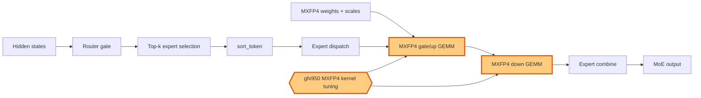

## 1. Module diagram

## 2. Motivation

Retuning the MXFP4 fused-MoE kernels targets gfx950-specific launch and quantized-layout behavior in routed expert computation.

## 3. Before vs. after

| Area | Before | After |
|---|---|---|
| MXFP4 kernel selection | Routed experts use the existing fused-MoE MXFP4 kernel configuration. | Routed experts select the retuned gfx950 MXFP4 configuration. |
| Quantized GEMMs | `gate/up` and `down` use the previous MXFP4 tile, scale, and launch policy. | `gate/up` and `down` use the gfx950-tuned MXFP4 tile, scale, and launch policy. |
| Dispatch and combine | Token sorting, expert dispatch, and result combination remain unchanged around the kernel calls. | Token sorting, expert dispatch, and result combination remain unchanged around the retuned kernel calls. |
| Unsupported devices or shapes | Existing backend guards and fallback dispatch handle unsupported cases. | The retuned configuration is selected only under its supported guards; existing fallback dispatch remains available. |

## 4. MiniMax-M3 migration steps

**Migration: unverified.** The action identifies ROCm/aiter PR #5045, but this workspace contains no checked-out target file or symbol showing the gfx950 MXFP4 retune. The available MiniMax-M3 source inventory identifies `models/minimax_m3/amd/model.py:255–438` for fused expert construction and `model_executor/layers/fused_moe/runner/moe_runner.py:410–466,731–779` for routed/shared execution, while the documented M3 snapshot is 8× MI325X/gfx942, TP8/PP1/DP1, EP off, vLLM `0.26.0+rocm723`, and dynamic FP8 routed experts; those references do not establish a reachable MXFP4 retune symbol or its gfx942 guards. Locate the PR's exact AITER kernel and dispatch symbols in the pinned image before deciding whether a guarded port is possible.
