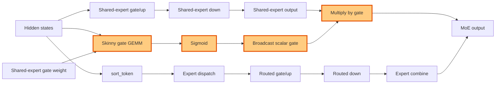

## 1. Module diagram

## 2. Motivation

Fusing the shared-expert skinny gate GEMM, sigmoid, broadcast, and output multiply removes intermediate launch boundaries while preserving a shape-guarded fallback.

## 3. Before vs. after

| Behavior | Before | After |
|---|---|---|
| Gate calculation | A separate skinny GEMM produces the shared-expert scalar gate. | The fused Triton kernel computes the skinny GEMM as part of the gate operation. |
| Activation | Sigmoid runs as a separate operation. | Sigmoid is evaluated in the fused kernel. |
| Gate expansion | The scalar gate is materialized or broadcast in a separate operation. | The kernel broadcasts the scalar over the shared-expert output in place. |
| Shared output scaling | A separate multiply applies the gate to the shared-expert output. | The fused kernel applies the gate while producing the scaled shared-expert output. |
| Unsupported shapes | The existing unfused shared-expert path handles unsupported inputs. | Shape, dtype, layout, and backend guards retain that path as the fallback. |

## 4. MiniMax-M3 migration steps

**Migration: unverified.** The target PR [#43190](https://github.com/vllm-project/vllm/pull/43190) is not checked out here, so its exact Triton file, fused-kernel symbol, and guard contract cannot be cited. The exact-image source inventory identifies `models/minimax_m3/amd/model.py:112–126,255–438` for MiniMax-M3 fused-expert construction, but this workspace does not contain that source root or a matching shared-gate call symbol; therefore it cannot establish the target-to-M3 correspondence or a source-backed blocker. The recorded M3 snapshot is 8× MI325X/gfx942, TP8/PP1/DP1, EP off, vLLM `0.26.0+rocm723`, AITER dense/sparse attention, Triton indexer, FP8 main KV, shared-expert fusion, INT4 QuickReduce, and DSpark draft `TRITON_ATTN`.
