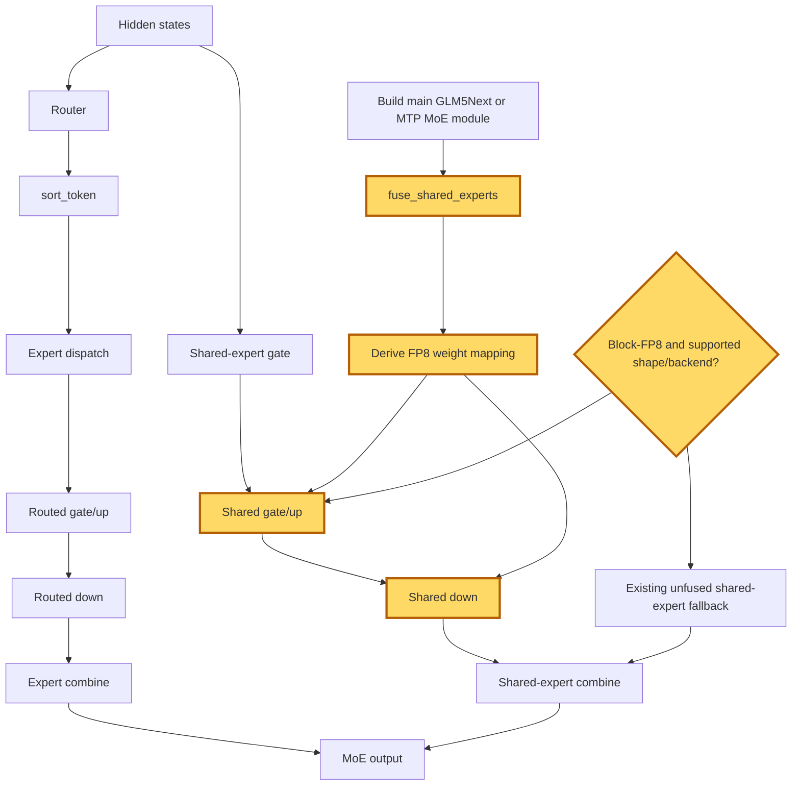

## 1. Module diagram

## 2. Motivation

Deriving the shared-expert weight mapping from each built module’s fusion flag keeps block-quantized FP8 fused experts consistent across the main GLM5Next MoE and its MTP block.

## 3. Before vs. after

| Behavior | Before | After |
|---|---|---|
| FP8 shared-expert dispatch | Block-quantized FP8 shared experts can use an unfused or unsupported route. | Compatible block-FP8 shared experts use the fused shared-expert route. |
| Main MoE construction | Fusion configuration and weight mapping can be selected independently. | The main GLM5Next MoE derives mapping behavior from its built module’s fusion flag. |
| MTP MoE construction | The MTP block can omit the fused shared-expert wiring or use a separate mapping assumption. | The MTP block receives the same guarded fused path and module-derived mapping contract. |
| Shared computation | Shared gate/up and down work remains split across the ordinary shared-expert path. | Compatible shared gate/up and down operations execute through the fused shared-expert implementation. |
| Unsupported shapes and dtypes | The existing implementation handles unsupported combinations without the new compatibility gate. | Unsupported block-FP8 shapes, dtypes, or backends retain the existing unfused fallback. |

## 4. MiniMax-M3 migration steps

**Migration: unverified.** The target [PR #53097](https://github.com/vllm-project/vllm/pull/53097) is not checked out here, so its exact block-FP8 shared-expert symbols, compatibility guard, and main/MTP weight-mapping symbols cannot be cited; the available MiniMax-M3 source inventory identifies `models/minimax_m3/amd/model.py:112–126,255–438` only as the fused-expert construction path and records `VLLM_ROCM_USE_AITER_FUSION_SHARED_EXPERTS=1` for the 8× MI325X/gfx942, TP8/PP1/DP1, EP-off, vLLM `0.26.0+rocm723` snapshot, without exposing separate main/MTP call symbols or proving whether this action is already fully selected.