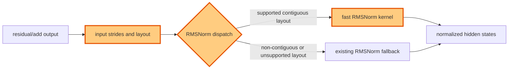

## 1. Module diagram

## 2. Motivation

The fast RMSNorm path should accept supported non-contiguous residual layouts without forcing a copy or abandoning the optimized kernel.

## 3. Before vs. after

| Behavior | Before | After |
|---|---|---|
| Input eligibility | The fast RMSNorm path requires its existing layout and contiguity contract. | Dispatch also accepts non-contiguous inputs whose strides satisfy the kernel contract. |
| Data movement | An eligible non-contiguous residual may require a layout conversion before normalization. | The fast kernel consumes the eligible residual layout directly. |
| Dispatch guard | Layout checks reject every non-contiguous input from the optimized path. | Layout, stride, dtype, shape, and device checks distinguish supported non-contiguous inputs from unsupported ones. |
| Fallback | Inputs rejected by the fast-path guard use the existing fallback implementation. | Inputs with unsupported strides or other mismatches still use the existing fallback implementation. |

## 4. MiniMax-M3 migration steps

**Migration: unverified.**

The available workspace contains no vLLM source checkout or MiniMax-M3 model implementation from which to identify the exact RMSNorm source file, symbol, residual layout, or current gfx942 dispatch guard; the action record identifies PR #49750 but does not provide those source paths. The current snapshot is 8× MI325X/gfx942, vLLM `0.26.0+rocm723`, TP8/PP1/DP1, EP off, AITER dense/sparse attention, Triton indexer, FP8 main KV, shared-expert fusion, INT4 QuickReduce, and DSpark with draft `TRITON_ATTN`; a source checkout and dispatch trace are required before choosing a portable patch or declaring a blocker.
