## 1. Module diagram

```mermaid
flowchart LR
    hidden_states[hidden_states] --> residual_a[residual reference]
    hidden_states --> clone_attn[redundant clone/copy before attention]
    clone_attn --> norm_attn[RMSNorm]
    norm_attn --> attention[GLM/DeepSeek attention]
    attention --> clone_attn_out[redundant attention-output copy]
    clone_attn_out --> add_attn[attention residual add]
    residual_a --> add_attn

    add_attn --> residual_b[residual reference]
    add_attn --> clone_ffn[redundant clone/copy before FFN]
    clone_ffn --> gate_up[gate/up]
    gate_up --> activation[activation]
    activation --> down[down]
    down --> clone_ffn_out[redundant FFN-output copy]
    clone_ffn_out --> add_ffn[FFN residual add]
    residual_b --> add_ffn
    add_ffn --> next_layer[next decoder layer]

    classDef focus fill:#ffd6d6,stroke:#c62828,stroke-width:3px;
    class clone_attn,clone_attn_out,clone_ffn,clone_ffn_out focus;
```

## 2. Motivation

Removing redundant GLM/DeepSeek clone and copy operations avoids unnecessary tensor materialization while preserving required residual ownership and aliasing boundaries.

## 3. Before vs. after

| Area | Before | After |
|---|---|---|
| Attention input | A separate clone or copy is created before attention. | The existing tensor is reused when downstream operations do not require independent storage. |
| Attention output | The attention result is copied before the residual update. | The residual update consumes the attention result directly when aliasing is safe. |
| FFN input | A clone or copy separates the attention residual from the FFN path. | The FFN path reuses the residual result when its mutation and lifetime contracts permit it. |
| FFN output | The down-projection result is copied before the final residual update. | The residual update consumes the down-projection result directly when no independent consumer needs it. |
| Safety boundaries | Copies protect possible mutation, lifetime, stride, or graph-allocation requirements. | Copies remain at verified ownership, mutation, layout, or graph-replay boundaries. |

## 4. MiniMax-M3 migration steps

Migration: unverified.

The available workspace does not contain the vLLM source files and symbols changed by [PR #46651](https://github.com/vllm-project/vllm/pull/46651), nor a MiniMax-M3 vLLM model implementation with which to match those call paths, so it cannot establish the exact clone/copy sites or prove that the current snapshot (8× MI325X/gfx942, vLLM `0.26.0+rocm723`, TP8/PP1/DP1, EP off, AITER attention, Triton indexer, FP8 KV) can safely reuse those buffers.
