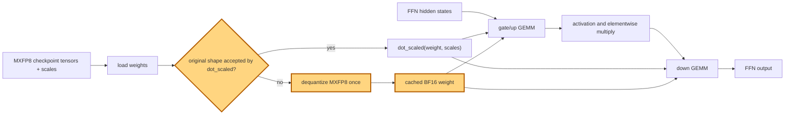

## 1. Module diagram

## 2. Motivation

Dequantizing an incompatible MXFP8 weight once during loading prevents repeated BF16 reconstruction on every FFN forward pass.

## 3. Before vs. after

| Behavior | Before | After |
|---|---|---|
| Weight representation | An incompatible MXFP8 shape is converted to a BF16 representation during forward execution. | The incompatible weight is converted once after loading and retained as a cached BF16 tensor. |
| `dot_scaled` dispatch | Forward dispatch attempts the scaled-dot path and handles unsupported original shapes with a per-forward conversion. | A shape guard selects `dot_scaled` only for supported original shapes and selects the cached representation otherwise. |
| FFN data movement | Gate/up and down GEMMs repeatedly receive newly materialized BF16 weights. | Gate/up and down GEMMs reuse the persistent representation selected at load time. |
| Supported layout contract | The fallback conversion is coupled to forward-time shape handling. | The loader preserves the quantization scales and produces the layout required by the selected GEMM path before inference. |

## 4. MiniMax-M3 migration steps

**Migration: unverified.** The action is implemented by PR [#56560](https://github.com/vllm-project/vllm/pull/56560), but this workspace has no checked-out target file or symbol exposing its MXFP8 loader and `dot_scaled` call site. The MiniMax-M3 source inventory records `models/minimax_m3/amd/model.py:255–438` for expert construction and `models/minimax_m3/amd/model.py:449–714` for attention/cache construction, but does not establish an M3 FFN weight-loader or MXFP8 `dot_scaled` path; the documented snapshot is 8× MI325X/gfx942, TP8/PP1/DP1, EP off, vLLM `0.26.0+rocm723`, AITER dense/sparse attention, Triton indexer, FP8 main KV, shared-expert fusion, INT4 QuickReduce, and DSpark draft `TRITON_ATTN`. The exact-image source root cited by the inventory (`../20260914-parallelism-in-mm3/inspection/vllm/`) is also absent here, so the source cannot establish either a reachable M3 call path or a blocking mismatch.
