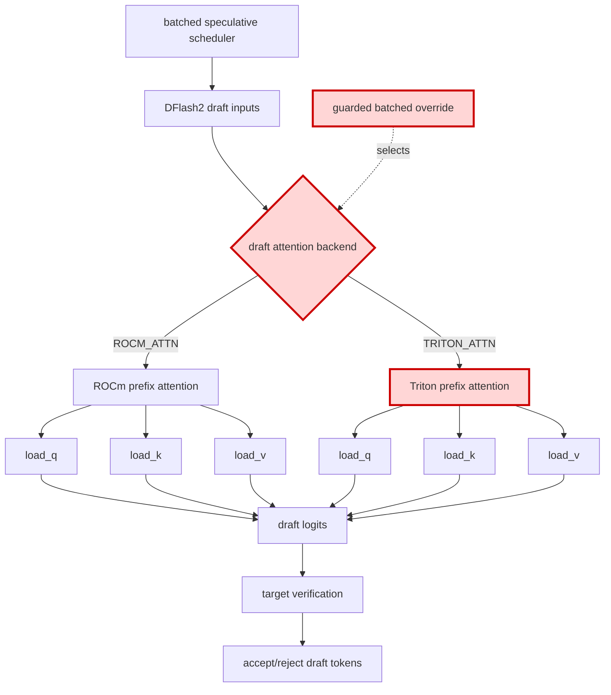

## 1. Module diagram

## 2. Motivation

Selecting `TRITON_ATTN` for the affected batched DFlash2 requests avoids relying on a ROCm prefix-attention backend that can reduce speculative-token acceptance.

## 3. Before vs. after

| Behavior | Before | After |
|---|---|---|
| Draft backend selection | The batched DFlash2 request uses the existing `ROCM_ATTN` selection. | A guarded condition selects `TRITON_ATTN` for the affected batched requests. |
| Draft attention execution | Q, K, and V are processed by the ROCm prefix-attention path. | Q, K, and V are processed by the Triton prefix-attention path. |
| Target verification | Target-model attention and draft/target token comparison use the existing path. | Target verification and token comparison remain unchanged. |
| Unsupported requests | Existing backend dispatch handles requests outside the supported condition. | The existing backend remains the fallback when the Triton override is not supported. |

## 4. MiniMax-M3 migration steps

**Migration: unverified.** The target change is PR [#53323](https://github.com/vllm-project/vllm/pull/53323), but this workspace has no vLLM checkout exposing its DFlash2 backend-selector symbol or the `ROCM_ATTN`/`TRITON_ATTN` prefix-attention dispatch, so the target patch point and guard cannot be established. The available M3 inventory only records DSpark draft `TRITON_ATTN` in `20260914-best-parallelism/MINIMAX-M3-PARALLEL.md:60`; it does not expose a matching DFlash2/DSpark source symbol or prove that the current batched path reaches `ROCM_ATTN`.

The relevant M3 snapshot is 8× MI325X/gfx942, TP8/PP1/DP1, EP off, vLLM `0.26.0+rocm723`, AITER dense/sparse attention, Triton indexer, FP8 main KV, shared-expert fusion, INT4 QuickReduce, and DSpark draft `TRITON_ATTN`. Obtain the deployed source, locate the DFlash2 selector and M3 draft call path, then apply a batch/architecture/backend-guarded override retaining the current fallback; compare draft outputs, acceptance, and graph capture/replay before benchmarking.
