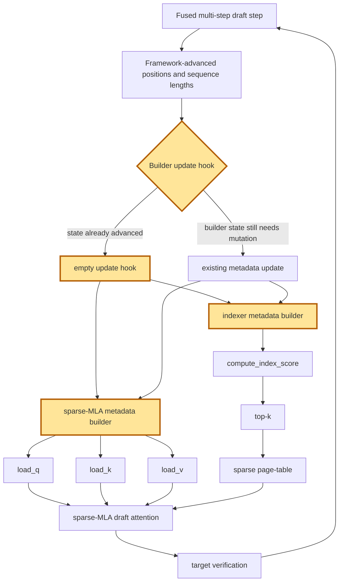

## 1. Module diagram

## 2. Motivation

The fused multi-step draft path should avoid rebuilding sparse-MLA and indexer metadata when the framework has already advanced positions and sequence lengths.

## 3. Before vs. after

| Behavior | Before | After |
|---|---|---|
| Position and length ownership | Metadata builders participate in the ordinary per-step update sequence. | The framework remains the owner of already-advanced positions and sequence lengths. |
| Sparse-MLA metadata | The sparse-MLA builder performs its normal update work on each speculative step. | The builder uses the fused multi-step path and skips its update when no builder-owned state changed. |
| Indexer metadata | The indexer builder performs its normal update work on each speculative step. | The indexer builder uses the same fused path and an empty update hook when its inputs are already current. |
| Attention inputs | Draft attention and index selection consume metadata after the regular update sequence. | Draft attention, `compute_index_score`, top-k, and sparse-page-table construction consume metadata tied to the framework-advanced state. |
| Exceptional state | The normal update path handles steps that still require metadata mutation. | The existing update path remains selected whenever builder-owned state, rollback, or other required mutation is present. |

## 4. MiniMax-M3 migration steps

**Migration: unverified.** The action is tracked by issue [#54369](https://github.com/vllm-project/vllm/issues/54369), but this workspace does not contain the issue's implementation or a target source file/symbol for its fused multi-step metadata hook. The available source inventory only exposes the generic builder calls `_create_kv_caches_and_metadata` and `main_builder.build`/`index_builder.build` in `20260914-best-parallelism/repos/aiconfigurator/collector/vllm/collect_msa_module.py:511-607`; that collector explicitly rejects ROCm and notes that ROCm routes MiniMax-M3 to `vllm/models/minimax_m3/amd/model.py`, which is not checked out here. For the current M3 snapshot—8× MI325X/gfx942, TP8/PP1/DP1, EP off, vLLM `0.26.0+rocm723`, AITER dense/sparse attention, Triton indexer, FP8 main KV, shared-expert fusion, INT4 QuickReduce, and DSpark draft `TRITON_ATTN`—the source therefore establishes neither a reachable ROCm fused-metadata hook nor a blocker; inspect the deployed `amd/model.py`, sparse-MLA/indexer builder symbols, and multi-step scheduler before selecting guarded migration and comparing eager versus graph-replayed metadata, attention outputs, sparse pages, cache writes, and accepted draft tokens.
