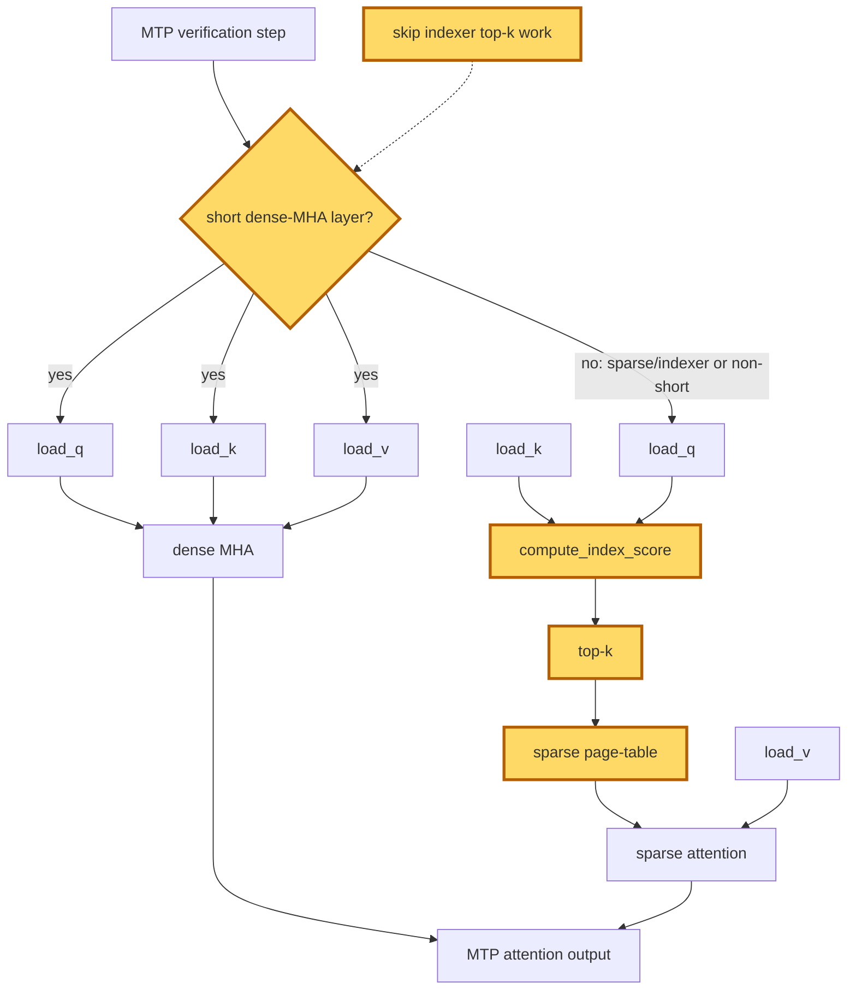

## 1. Module diagram

## 2. Motivation

Short dense-MHA layers in MTP need no sparse-indexer top-k metadata when no downstream consumer reads it.

## 3. Before vs. after

| Behavior | Before | After |
|---|---|---|
| MTP layer dispatch | The MTP path can enter sparse-indexer bookkeeping before excluding short dense-MHA layers. | Dispatch classifies layer type and sequence length before selecting indexer work. |
| Dense-MHA processing | A short dense-MHA layer may run `compute_index_score`, top-k, and sparse-page-table construction. | An eligible layer runs `load_q`, `load_k`, `load_v`, and dense MHA without indexer top-k work. |
| Sparse/indexer processing | Sparse or indexer layers use index scores, top-k, and sparse-page-table metadata. | Sparse or indexer layers retain the existing indexer path. |
| Metadata consumers | Unneeded indexer metadata can be produced during MTP verification. | Indexer metadata is omitted only when the layer is proven not to consume it. |
| Fallback behavior | The existing attention dispatch handles all layer categories. | Layers outside the guarded predicate retain the existing attention dispatch. |

## 4. MiniMax-M3 migration steps

**Migration: unverified.** The target is PR [#50904](https://github.com/vllm-project/vllm/pull/50904), but the available checkout contains neither that patch nor the vLLM model/attention implementation exposing its exact top-k guard symbol. The only local M3-related source, `20260914-best-parallelism/repos/aiconfigurator/collector/vllm/collect_msa_module.py`, constructs generic `main_builder.build` and `index_builder.build` metadata but does not expose the ROCm MiniMax-M3 MTP layer schedule or its sparse-indexer consumer check; the referenced `vllm/models/minimax_m3/amd/model.py` is not present. The current snapshot is 8× MI325X/gfx942, TP8/PP1/DP1, EP off, vLLM `0.26.0+rocm723`, AITER dense/sparse attention, Triton indexer, FP8 main KV, shared-expert fusion, INT4 QuickReduce, and DSpark draft `TRITON_ATTN`; obtain that deployed source, locate the MTP layer-dispatch/top-k symbols, and only then add a dense-MHA/short-length guard retaining the existing sparse fallback and compare outputs, metadata, and graph replay.
