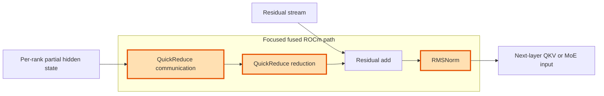

## 1. Module diagram

## 2. Motivation

Fusing ROCm QuickReduce with the following residual addition and RMSNorm removes an intermediate activation boundary while preserving the normalized hidden-state contract.

## 3. Before vs. after

| Behavior | Before | After |
|---|---|---|
| Reduction result | QuickReduce materializes its reduced activation before normalization. | The reduced value feeds the fused add-and-normalize path directly. |
| Kernel boundaries | Communication/reduction, residual addition, and RMSNorm are separate execution stages. | QuickReduce completion and RMSNorm are represented by one fused ROCm execution path where supported. |
| Activation movement | The reduced activation may be written and reread between stages. | The fused path keeps the intermediate reduction result within the producer/consumer operation. |
| Unsupported layouts | The existing QuickReduce and RMSNorm implementations handle unsupported shapes or layouts. | The existing unfused path remains the fallback for unsupported shapes, dtypes, layouts, or backends. |
| Layer interface | The next layer consumes the RMSNorm output from the separate operations. | The next layer consumes an equivalent RMSNorm output from the fused operation. |

## 4. MiniMax-M3 migration steps

**Migration: unverified.** The workspace has no checked-out vLLM source exposing PR [#48249](https://github.com/vllm-project/vllm/pull/48249)'s QuickReduce/RMSNorm fused symbol or dispatch guard, and no MiniMax-M3 model implementation exposing the corresponding call path; `20260908-profiling-ep/hotspot.md:9-13,39-44` only records `quickreduce allreduce` and `fused add RMSNorm` profile labels, while `20260828-model-level-optimization/docs/mi325x-fp8-recommendation.md:30-48` records the M3 recipe (`ROCM_AITER_UNIFIED_ATTN`, FP8 KV, TP8/PP1/DP1). Obtain the deployed vLLM `0.26.0+rocm723` sources, locate the QuickReduce and RMSNorm symbols used by the 8× MI325X/gfx942, EP-off, INT4-QuickReduce MiniMax-M3 path, then compare the PR implementation and its dtype/layout/architecture guards before deciding whether a guarded port and graph-replay correctness check are possible.
