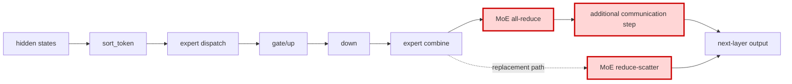

## 1. Module diagram

## 2. Motivation

The MoE output path should produce the downstream rank-local shard with reduce-scatter while removing the redundant communication step.

## 3. Before vs. after

| Area | Before | After |
|---|---|---|
| Expert computation | Token sorting, dispatch, `gate/up`, `down`, and expert combine produce the MoE output. | The same expert computation produces the MoE output. |
| Output collective | The combined output enters an all-reduce. | The combined output enters reduce-scatter. |
| Communication sequence | An additional communication operation follows the all-reduce. | The additional operation is removed. |
| Output layout | The downstream path receives the replicated result produced by the all-reduce sequence. | The downstream path receives the rank-local shard expected from reduce-scatter. |

## 4. MiniMax-M3 migration steps

**Migration: unverified.** The workspace has no checked-out vLLM source file or symbol implementing the target changes from PRs [#46635](https://github.com/vllm-project/vllm/pull/46635) and [#48763](https://github.com/vllm-project/vllm/pull/48763), so the target collective call site and its fallback contract cannot be cited without inventing them.

The available M3 model graph routes `MiniMaxM3Model._routed_moe_ops` through `build_moe_block_ops` in `20260914-best-parallelism/repos/aiconfigurator/aic-core/src/aiconfigurator_core/sdk/models/minimax_m3.py:156–178`; `20260914-best-parallelism/repos/aiconfigurator/aic-core/src/aiconfigurator_core/sdk/models/blocks/moe.py:172–313` emits `MoEDispatch`/`MoE` pre- and post-dispatch operations, while `minimax_m3.py:67–76` rejects `moe_comm_backend` for this model. Those source paths describe a model graph rather than the deployed vLLM collective implementation and do not establish whether M3's TP8/EP-off runtime reaches an all-reduce or a removable extra step.

The unresolved snapshot is 8× MI325X/gfx942, TP8/PP1/DP1, EP off, vLLM `0.26.0+rocm723`, AITER dense/sparse attention, Triton indexer, FP8 main KV, shared-expert fusion, INT4 QuickReduce, and DSpark draft `TRITON_ATTN`; inspect that image's routed-MoE post-dispatch symbol and collective trace before selecting a guarded reduce-scatter port.
