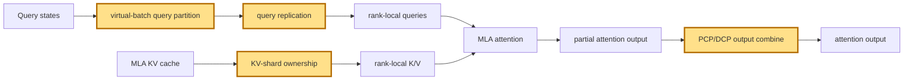

## 1. Module diagram

## 2. Motivation

Virtual-batch PCP/DCP-style MLA parallelism assigns KV context to ranks while replicating queries and combining partial attention outputs.

## 3. Before vs. after

| Behavior | Before | After |
|---|---|---|
| KV ownership | MLA ranks retain the existing replicated KV-cache ownership. | PCP/DCP groups assign KV context shards to rank-local virtual batches. |
| Query distribution | Each rank processes its query against the replicated context. | Queries are replicated or exchanged to the ranks owning the relevant KV shards. |
| Attention result | Each rank produces an output from its full local cache view. | Each rank produces a partial output that is combined across the PCP/DCP group. |
| Parallel dispatch | The existing MLA backend and TP mapping determine execution. | Dispatch additionally selects virtual-batch partitioning, KV ownership, and collective-combine metadata. |

## 4. MiniMax-M3 migration steps

**Migration: unverified.** The action targets NVIDIA/FlashInfer-side MLA parallelism in PRs [#46570](https://github.com/vllm-project/vllm/pull/46570) and [#46076](https://github.com/vllm-project/vllm/pull/46076), but this workspace contains neither their exact vLLM source symbols nor a vLLM MiniMax-M3 implementation exposing the corresponding MLA query-replication and KV-shard call path. The local M3 evidence is the serving snapshot in `20260914-best-parallelism/MINIMAX-M3-PARALLEL.md` and the TRT-LLM collector path `20260914-best-parallelism/repos/aiconfigurator/collector/trtllm/collect_msa_module.py:301-302,526-592`, not the target vLLM path; therefore source evidence does not establish either a reachable migration point or a code-level blocker for the current 8× MI325X/gfx942, TP8/PP1/DP1, EP-off, vLLM `0.26.0+rocm723`, AITER dense/sparse, Triton-indexer, FP8-main-KV, shared-expert-fusion, INT4-QuickReduce, DSpark/`TRITON_ATTN` snapshot.
