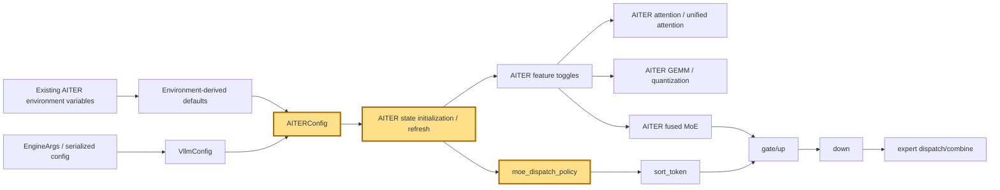

## 1. Module diagram

## 2. Motivation

An explicit `AITERConfig` makes AITER feature selection and MoE dispatch policy reproducible across `VllmConfig`, workers, and compilation instead of depending on scattered environment-derived state.

## 3. Before vs. after

| Area | Before | After |
|---|---|---|
| Configuration ownership | AITER toggles and dispatch policy are read through environment-derived module state. | AITER toggles and `moe_dispatch_policy` are fields of `VllmConfig`'s `AITERConfig`. |
| Defaults | Existing environment variables provide implicit defaults. | The config preserves those environment-variable defaults while allowing explicit overrides. |
| Worker state | Workers can initialize AITER behavior from independently resolved process state. | Workers receive and synchronize the resolved AITER configuration. |
| Compilation identity | AITER choices are not necessarily represented by the engine configuration identity. | AITER configuration participates in explicit configuration and compilation-state handling. |
| Testability | Tests manipulate environment state to exercise AITER behavior. | Tests can construct, serialize, refresh, and inspect a typed AITER configuration. |

## 4. MiniMax-M3 migration steps

**Migration: unverified.** The available workspace contains the action inventory and experiment notes but no vLLM source checkout establishing the target `AITERConfig`/`VllmConfig` definitions or MiniMax-M3 call path; the relevant snapshot is 8× MI325X/gfx942, TP8/PP1/DP1, EP off, vLLM `0.26.0+rocm723`, AITER dense/sparse attention, Triton indexer, FP8 main KV, shared-expert fusion, INT4 QuickReduce, and DSpark draft `TRITON_ATTN`.
