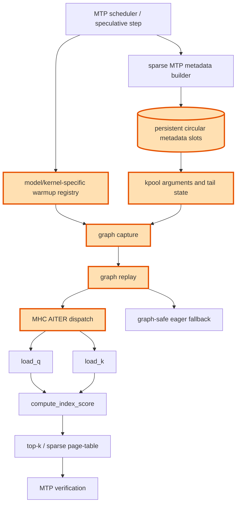

## 1. Module diagram

## 2. Motivation

Sparse MTP replay needs registered warmups and persistent metadata so captured launches receive valid model-specific arguments and stable slot state.

## 3. Before vs. after

| Behavior | Before | After |
|---|---|---|
| Warmup coverage | Generic warmups may omit a sparse-MTP model, kernel, or capture shape. | The model-specific sparse-MTP kernels and capture shapes are registered before capture. |
| Metadata lifetime | Replay can observe transient or rebound sparse metadata storage. | Replay consumes metadata from persistent circular slots with stable addresses. |
| Argument propagation | `kpool` arguments and tail state can remain stale across MTP steps. | Each captured and replayed step receives the corresponding `kpool` arguments and tail state. |
| Dispatch | Sparse MTP replay may resolve an unintended attention/kernel path. | Warmed-up replay selects the intended MHC AITER and sparse-indexer dispatch. |
| Unsupported state | Dynamic or unsupported shapes enter graph execution without a stable contract. | Unsupported shapes retain the existing graph-safe eager fallback. |

## 4. MiniMax-M3 migration steps

Migration: unverified.

The target PR #53943 implementation and its exact vLLM warmup, `kpool`, MHC-dispatch, and circular-slot symbols are not present in this workspace, so the target call path cannot be located in source.  The available MiniMax-M3 model graph is `20260914-best-parallelism/repos/aiconfigurator/aic-core/src/aiconfigurator_core/sdk/models/minimax_m3.py:88-123,188-210`, where `generation_ops` includes MTP-scaled `GenerationMSAModule` and MoE operations, while the only graph-stable metadata implementation is the separate TRT-LLM collector at `20260914-best-parallelism/repos/aiconfigurator/collector/trtllm/collect_msa_module.py:create_kv_cache_and_metadata` and `run_msa_module` (including `use_cuda_graph`); neither exposes the vLLM sparse-MTP replay path or PR #53943's `kpool`/slot symbols.  The relevant M3 snapshot is 8× MI325X/gfx942, TP8/PP1/DP1, EP off, vLLM `0.26.0+rocm723`, AITER dense/sparse attention, Triton indexer, FP8 main KV, shared-expert fusion, INT4 QuickReduce, and DSpark draft `TRITON_ATTN`; obtain that image's vLLM source before choosing a guarded port or correctness test.
